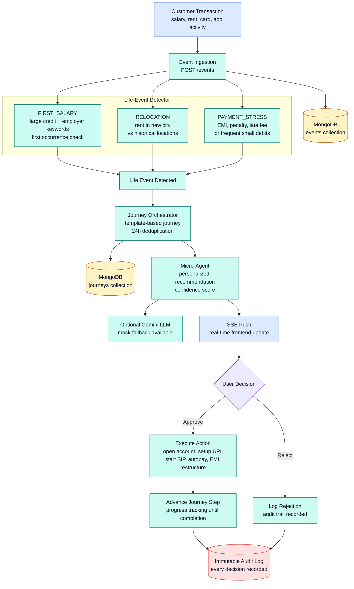

<div align="center">

# SBI FlowSense

### Agentic AI Banking Intelligence Platform

*Event-driven life-event detection, journey orchestration, and AI-powered banking recommendations — with consent-first execution and full auditability.*

**Built for the SBI Hackathon @GFF 2026**

[](https://python.org)
[](https://react.dev)
[](https://fastapi.tiangolo.com)
[](https://mongodb.com)
[](https://docker.com)

---

</div>

## The Problem

Traditional banking is **reactive** — customers must discover products, remember deadlines, and manage finances manually. Banks miss critical moments where personalized intervention could transform the customer relationship.

## Our Solution

**FlowSense** detects life events from transaction patterns in real-time and activates AI agents that deliver personalized banking recommendations — all with explicit user consent and an immutable audit trail.

```
Transaction Stream → Life-Event Detection → Journey Orchestration → AI Agent Recommendations → User Consent → Execution
```

---

## System Architecture

SBI FlowSense is organized into five clear layers:

| Layer | Responsibility |
|---|---|
| **Experience** | React dashboard, journey tracker, AI agent cards, and real-time updates. |
| **Event Gateway** | FastAPI ingestion through `POST /events`, validation, persistence, and streaming. |
| **Intelligence** | Life-event detection, journey orchestration, and bounded micro-agent recommendations. |
| **Execution Guard** | Consent capture, approve/reject handling, mock banking execution, and journey advancement. |
| **Data & Audit** | MongoDB collections for events, journeys, consents, executed actions, and immutable audit logs. |

For the visual flow, see the interactive Data Flow diagram below. For implementation-level details, see [ARCHITECTURE.md](docs/ARCHITECTURE.md).

---

## Data Flow

GitHub README files do not support custom JavaScript, so this section uses a GitHub-native Mermaid diagram plus expandable step details.



<details>
<summary><strong>Step 1: Event ingestion</strong></summary>

A customer banking signal enters through `POST /events`. The event is stored in MongoDB and can be published to Kafka in distributed mode.

</details>

<details>
<summary><strong>Step 2: Life-event detection</strong></summary>

FlowSense checks the incoming event against rule-based detectors for `FIRST_SALARY`, `RELOCATION`, and `PAYMENT_STRESS`. Each detected event includes confidence and trace metadata.

</details>

<details>
<summary><strong>Step 3: Journey orchestration</strong></summary>

The Journey Orchestrator maps the life event to a journey template, applies 24-hour deduplication, creates a journey record, and tracks step progress.

</details>

<details>
<summary><strong>Step 4: Micro-agent recommendation</strong></summary>

The relevant bounded micro-agent creates a personalized recommendation card. Gemini can be used for dynamic copy, with deterministic mock fallback for demos.

</details>

<details>
<summary><strong>Step 5: Consent and execution</strong></summary>

The user approves or rejects the action. Approved actions go through the execution layer; rejected actions are still recorded for auditability.

</details>

<details>
<summary><strong>Step 6: Audit trail</strong></summary>

Every event, detection, journey, recommendation, consent, execution, and rejection is written to the audit trail with traceable IDs.

</details>

---

## Life Event Detection Logic

| Life Event | Trigger Conditions | Confidence | Agent |
|---|---|---|---|
| **FIRST_SALARY** | Credit > ₹15,000 + employer keywords (salary, employer, payroll) + first occurrence for customer | 0.85 - 0.95 | Acquisition |
| **RELOCATION** | Rent payment in a city different from historical transactions | 0.80 - 0.92 | Lifestyle |
| **PAYMENT_STRESS** | Stress keywords (minimum due, EMI bounce, penalty, late fee) OR 4+ small debits (<₹1000) in last 10 transactions | 0.65 - 0.92 | Engagement |

---

## Quick Start

### Prerequisites

- **Docker** (for MongoDB)
- **Python 3.11+**
- **Node.js 18+**

### 1. Clone & Setup

```bash
git clone https://github.com/krish57-bit/SBI-FLOWSENSE.git
cd SBI-FLOWSENSE
```

### 2. Start MongoDB

```bash
docker compose up -d mongodb
```

### 3. Install & Seed Backend

```bash
pip install -r services/event-ingestion/requirements-standalone.txt
python seed_data.py
```

### 4. Start Backend (Standalone Mode)

```bash
# Windows
start-standalone.bat

# Linux/Mac
./start-standalone.sh
```

### 5. Start Frontend

```bash
cd frontend
npm install
npm run dev
```

### 6. Open the App

Navigate to **http://localhost:5173**

- Enter any account number (e.g., `cust_123`) and any 6-digit MPIN
- Use the **Demo Controls** panel to simulate banking events
- Watch AI agents detect life events and recommend actions in real-time

---

## Demo Flow

```
1. Sign In          →  Enter account number + 6-digit MPIN verification
2. Dashboard        →  View balance, stats, recent transactions
3. Simulate Event   →  Click "Salary Credit" in Demo Controls
4. Agent Appears    →  AI Agent card with confidence score + recommendation
5. Approve/Reject   →  Consent-first execution
6. Journey Advances →  Multi-step journey progresses
7. Audit Trail      →  Every action logged immutably
```

### Three Simulate Buttons

| Button | Event | Detection | Agent Response |
|---|---|---|---|
| 💰 **Salary Credit** | +₹75,000 from Employer | FIRST_SALARY | "Open Salary Account" with zero-balance benefits |
| 🏠 **Rent Payment** | ₹18,000 to new city | RELOCATION | "Set up Auto-pay" for rent |
| 💳 **Card Payment** | ₹1,500 minimum due | PAYMENT_STRESS | "Restructure EMI" with lower plan |

---

## Project Structure

```
sbi-flowsense/
│
├── frontend/                          # React SPA (Vite)
│   ├── public/
│   │   ├── favicon.svg               # App favicon
│   │   ├── logo.svg                  # Full brand logo
│   │   ├── logo-icon.svg             # Compact icon logo
│   │   └── icons.svg                 # UI icon sprites
│   ├── src/
│   │   ├── App.jsx                   # Complete SPA — login, dashboard, agents, journeys
│   │   ├── index.css                 # Full design system — variables, components, responsive
│   │   └── main.jsx                  # React entry point
│   ├── index.html
│   ├── package.json
│   └── vite.config.js
│
├── services/
│   ├── event-ingestion/               # Core API Gateway (FastAPI)
│   │   ├── main.py                   # All routes, detection, orchestration, execution
│   │   ├── Dockerfile
│   │   ├── requirements.txt          # Full stack dependencies
│   │   └── requirements-standalone.txt # Minimal (no Kafka)
│   │
│   ├── life-event-detector/           # Distributed Kafka consumer
│   │   ├── detector.py
│   │   ├── Dockerfile
│   │   └── requirements.txt
│   │
│   └── orchestrator-agents/           # Distributed Kafka consumer
│       ├── orchestrator.py
│       ├── Dockerfile
│       └── requirements.txt
│
├── docs/                              # Documentation
│   ├── PRD.md                        # Product Requirements Document
│   ├── ARCHITECTURE.md               # Detailed system architecture
│   ├── CLAUDE_CONTEXT.md             # AI coding context
│   └── plan.md                       # Project plan with epics
│
├── docker-compose.yml                 # Full stack: MongoDB + Kafka + services
├── seed_data.py                       # Database seeder (20 Mumbai transactions)
├── start-standalone.bat               # Windows one-click startup
├── start-standalone.sh                # Linux/Mac one-click startup
├── .gitignore
└── README.md                          # This file
```

---

## API Reference

| Method | Endpoint | Description |
|--------|----------|-------------|
| `POST` | `/events` | Ingest a transaction event |
| `GET` | `/api/events/recent` | Last 20 transactions |
| `GET` | `/api/stats` | Balance, totals, agent count |
| `POST` | `/api/consents` | Approve or reject an agent action |
| `GET` | `/api/agent-actions/{id}` | Agent recommendations for customer |
| `GET` | `/api/journeys/{id}` | Customer journey progress |
| `GET` | `/api/life-events/{id}` | Detected life events |
| `GET` | `/api/audit-log` | Immutable audit trail |
| `GET` | `/stream` | SSE for real-time agent actions |
| `GET` | `/health` | System health check |

---

## Tech Stack

| Layer | Technology | Purpose |
|-------|-----------|---------|
| **Frontend** | React 19, Vite | Single-page dashboard with SSE |
| **Backend** | Python, FastAPI, Uvicorn | REST API + event processing |
| **Database** | MongoDB 7.0 | 7 collections for full data model |
| **Messaging** | Apache Kafka (optional) | Distributed event streaming |
| **AI** | Google Gemini (optional) | Personalized agent messages |
| **Infra** | Docker, Docker Compose | One-command deployment |

---

## Deployment Modes

### Standalone (Demo)

Single Python process handles everything inline. No Kafka needed.

```bash
# Just MongoDB + Backend + Frontend
docker compose up -d mongodb
start-standalone.bat   # or ./start-standalone.sh
cd frontend && npm run dev
```

### Full Stack (Production-like)

Distributed microservices with Kafka message bus.

```bash
# Everything via Docker Compose
docker compose up -d
cd frontend && npm run dev
```

---

## Security & Governance

- **Consent-First**: Agents recommend, users decide — no autonomous execution
- **Immutable Audit Trail**: Every detection, recommendation, decision, and execution logged
- **MPIN Verification**: 6-digit PIN entry for account access
- **Agent Isolation**: Agents cannot directly modify account data
- **Execution Guard**: Only the Execution Service writes to accounts, after consent

---

## MongoDB Collections

| Collection | Purpose | Key Fields |
|---|---|---|
| `events` | Raw transaction events | customer_id, type, amount, merchant, city |
| `life_events` | Detected life events | type, confidence, detected_at |
| `journeys` | Multi-step journey state | template, steps, current_step, status |
| `agent_actions` | AI recommendations | agent, action, confidence, message |
| `consents` | User decisions | action_id, decision, timestamp |
| `executed_actions` | Completed actions | action_type, result, executed_at |
| `audit_log` | Immutable audit trail | event_type, details, timestamp |

---

## Documentation

| Document | Description |
|----------|-------------|
| [PRD.md](docs/PRD.md) | Product requirements, personas, success criteria |
| [ARCHITECTURE.md](docs/ARCHITECTURE.md) | Detailed system architecture and design decisions |
| [plan.md](docs/plan.md) | Project plan with 8 epics and task tracking |
| [PHASE_1_SUBMISSION.md](docs/PHASE_1_SUBMISSION.md) | SBI Hackathon Phase 1 idea submission write-up |
| [PHASE_1_IDEA_DECK.md](docs/PHASE_1_IDEA_DECK.md) | Slide-by-slide Phase 1 idea deck script |
| [WINNING_GUIDE.md](docs/WINNING_GUIDE.md) | Judge-focused demo, deck, and final-week checklist |
| [CLAUDE_CONTEXT.md](docs/CLAUDE_CONTEXT.md) | AI coding context and development guide |

---

<div align="center">

**Built with purpose for the SBI Hackathon @GFF 2026**

*Transforming reactive banking into proactive, AI-powered financial intelligence*

</div>
